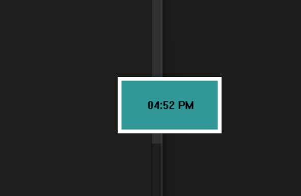

# Top Clock - a clock that stays on top

This is a simple clock for Windows that displays the time in HH:MM AM/PM 12 hour
format and always stays on top. It's useful if you want to know the time while
watching Youtube fullscreen or playing some supported games.

## Installation

Install by using one of the installers in the Releases - EXE or MSI. Then it is
available from the Start Menu as TopClock.

## Usage

The clock will start in the top left of the screen. To move it just click and
drag on the clock. To quit, select the window and type Q.

## Build

Open the project solution `Clock\Clock.sln` in VS 2022. You will need the
standard C++ setup for Win32 apps. Then click the green play button at the top.

## Release

Rick click on TopClockSetup and click Build. An EXE and MSI Installer will be
created at `ClockSetup\Release`